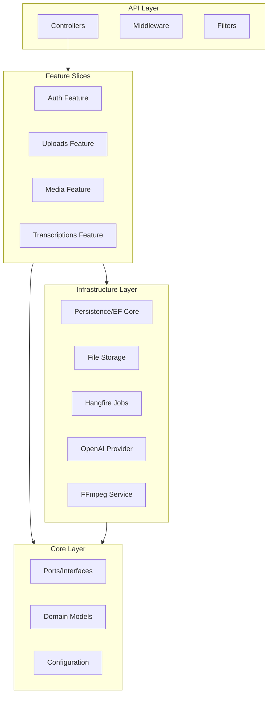
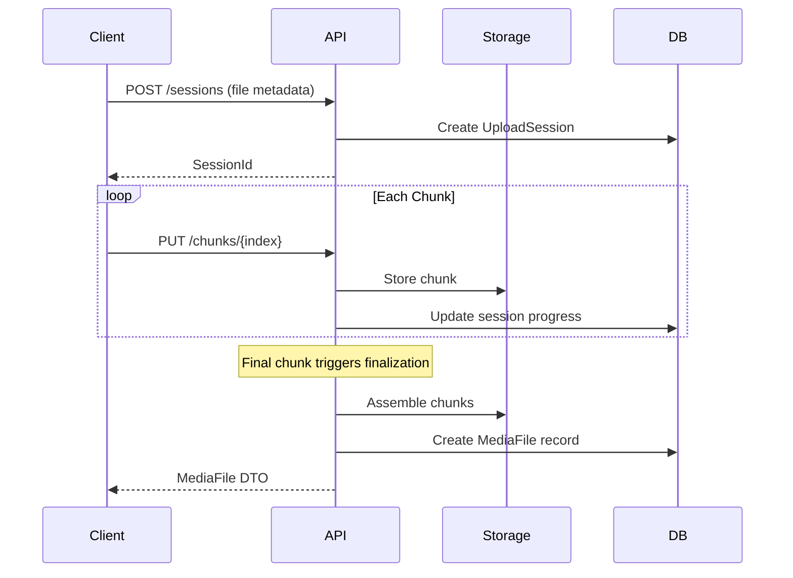
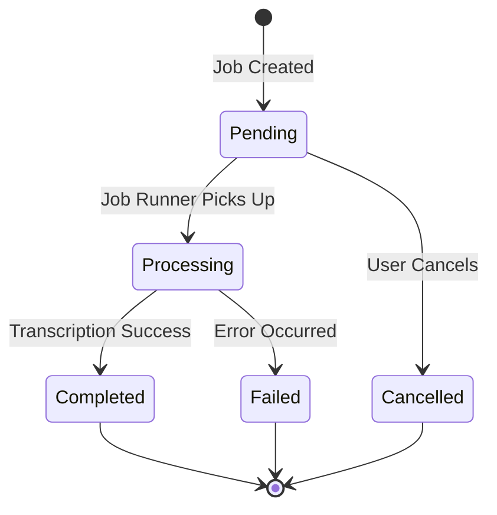
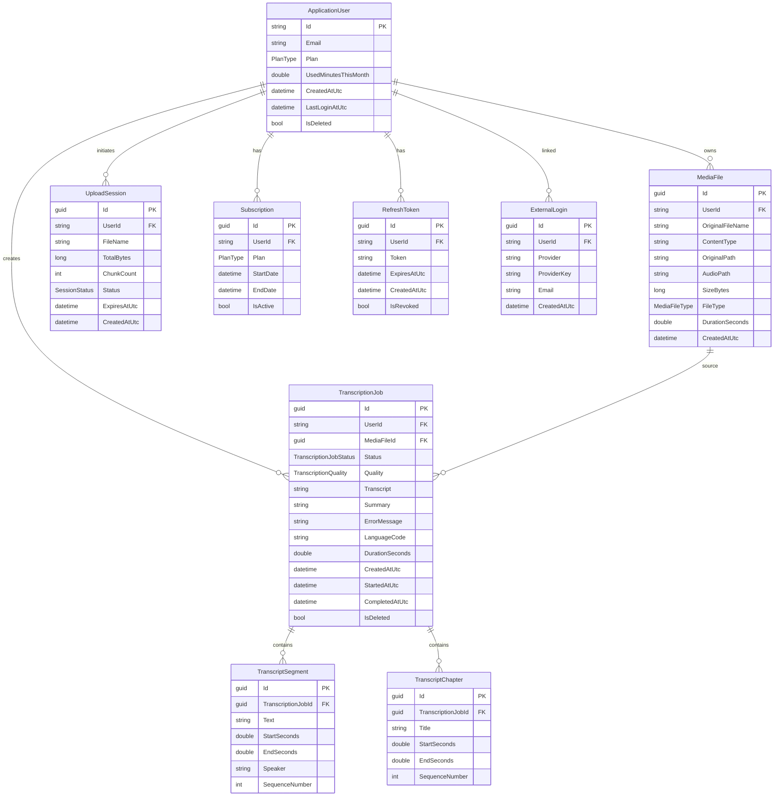

# ScribeAPI - Product Requirements Document

**Version**: 1.0  
**Date**: December 11, 2025  
**Status**: Current Implementation

---

## 1. Executive Summary

**ScribeAPI** is a cloud-based audio/video transcription API service that enables users to upload media files and receive accurate transcriptions powered by OpenAI's Whisper model. The platform offers a tiered subscription system (Free and Pro plans) with plan-based usage limits, background job processing, and comprehensive authentication including OAuth integration.

### Vision
To provide developers and businesses with a reliable, scalable, and developer-friendly transcription API that handles the complexity of audio processing, job queuing, and transcription while offering flexible subscription tiers to accommodate different usage needs.

---

## 2. Product Overview

### 2.1 Core Value Proposition

| Capability | Description |
|------------|-------------|
| **AI-Powered Transcription** | Leverages OpenAI Whisper for high-accuracy speech-to-text |
| **Chunked Uploads** | Supports large file uploads via resumable chunked transfer |
| **Background Processing** | Asynchronous job processing with priority queues |
| **Tiered Plans** | Flexible Free/Pro subscription tiers with configurable limits |
| **Segment-Level Output** | Returns timestamped transcript segments for navigation |

### 2.2 Target Users

1. **Developers** building applications requiring transcription capabilities
2. **Content Creators** transcribing podcasts, interviews, and videos
3. **Businesses** automating meeting transcription and documentation
4. **Researchers** processing audio/video content for analysis

---

## 3. System Architecture

### 3.1 Technology Stack

| Layer | Technology |
|-------|------------|
| **Runtime** | .NET 8 |
| **Database** | PostgreSQL with Entity Framework Core |
| **Authentication** | ASP.NET Identity + JWT Bearer Tokens |
| **Background Jobs** | Hangfire with PostgreSQL storage |
| **Transcription** | OpenAI Whisper API |
| **Media Processing** | FFmpeg |
| **API Documentation** | Swashbuckle (Swagger/OpenAPI) |

### 3.2 Architecture Pattern



---

## 4. Feature Specifications

### 4.1 Authentication & Authorization

#### Endpoints (`/api/auth`)

| Method | Endpoint | Auth | Description |
|--------|----------|------|-------------|
| POST | `/register` | Public | Register new user account |
| POST | `/login` | Public | Authenticate and receive JWT tokens |
| POST | `/refresh` | Public | Refresh access token using refresh token |
| POST | `/forgot-password` | Public | Request password reset email |
| POST | `/reset-password` | Public | Reset password with token |
| POST | `/change-password` | Required | Change authenticated user's password |
| GET | `/confirm-email` | Public | Confirm email address |
| POST | `/revoke-token` | Required | Revoke all refresh tokens |
| POST | `/external-login` | Public | Login via OAuth provider |
| POST | `/oauth/callback` | Public | Handle OAuth callback |
| POST | `/oauth/link` | Required | Link OAuth account to existing user |
| GET | `/oauth/linked-accounts` | Required | List linked OAuth accounts |
| DELETE | `/oauth/unlink/{provider}` | Required | Unlink OAuth account |
| GET | `/me` | Required | Get current user profile |

#### Supported OAuth Providers
- Google (configured via `appsettings.json`)
- Microsoft (infrastructure ready)

#### Security Features
- JWT-based authentication with configurable expiry
- Refresh token rotation with 7-day expiry
- Email confirmation flow
- Password reset with token expiration
- External login linking/unlinking

---

### 4.2 File Upload System

#### Endpoints (`/api/uploads`)

| Method | Endpoint | Auth | Description |
|--------|----------|------|-------------|
| POST | `/sessions` | Required | Initialize an upload session |
| PUT | `/sessions/{sessionId}/chunks/{chunkIndex}` | Required | Upload a file chunk |

#### Upload Flow



#### Session Properties
- **Expiration**: Sessions expire after configurable period
- **Validation**: File size, type, and plan limits checked
- **Resumability**: Supports resuming interrupted uploads
- **Cleanup**: Expired sessions cleaned up automatically

---

### 4.3 Media Management

#### Endpoints (`/api/media`)

| Method | Endpoint | Auth | Description |
|--------|----------|------|-------------|
| GET | `/` | Required | List user's media files (paginated) |
| GET | `/{id}` | Required | Get single media file details |
| DELETE | `/{id}` | Required | Delete media file |

#### Media File Attributes

| Field | Type | Description |
|-------|------|-------------|
| `id` | GUID | Unique identifier |
| `originalFileName` | string | Original upload filename |
| `contentType` | string | MIME type |
| `originalPath` | string | Storage path for original file |
| `audioPath` | string? | Path to normalized audio (if processed) |
| `sizeBytes` | long | File size in bytes |
| `fileType` | enum | Audio or Video |
| `durationSeconds` | double? | Duration after processing |
| `createdAtUtc` | datetime | Upload timestamp |

---

### 4.4 Transcription Jobs

#### Endpoints (`/api/transcriptions`)

| Method | Endpoint | Auth | Description |
|--------|----------|------|-------------|
| POST | `/` | Required | Create new transcription job |
| GET | `/{jobId}` | Required | Get job status and results |

#### Job Lifecycle



#### Transcription Quality Levels

| Level | Description |
|-------|-------------|
| **Fast** | Lower cost, lower accuracy |
| **Balanced** | Default setting, good balance |
| **Accurate** | Slower, more expensive, best quality |

#### Output Structure

A completed transcription includes:

1. **Full Transcript**: Complete text of the transcription
2. **Segments**: Timestamped segments with speaker info (when available)
   ```json
   {
     "text": "Hello, welcome to the meeting.",
     "startSeconds": 0.0,
     "endSeconds": 2.5,
     "speaker": null
   }
   ```
3. **Chapters**: Logical sections (future enhancement)
4. **Detected Language**: ISO language code

#### Background Processing

Jobs are processed via Hangfire with:
- **Priority Queues**: Pro users get priority processing
- **FFmpeg Preprocessing**: Audio normalization before transcription
- **Usage Tracking**: Minutes consumed tracked per user
- **Error Handling**: Failed jobs retain error messages

---

## 5. Subscription Plans

### 5.1 Plan Comparison

| Feature | Free Plan | Pro Plan |
|---------|-----------|----------|
| **Daily Transcription Limit** | 10 | Unlimited |
| **Max Minutes Per File** | 10 min | 300 min (5 hrs) |
| **Max File Size** | 100 MB | 1 GB |
| **Max Concurrent Jobs** | 1 | 5 |
| **Priority Processing** | ❌ | ✅ |
| **Translation** | ❌ | ✅ (future) |
| **All Models** | ❌ | ✅ (future) |
| **Unlimited Storage** | ❌ | ✅ (future) |

### 5.2 Plan Enforcement

The `PlanGuard` service validates:
- File size against plan limits
- File duration against plan limits
- Concurrent job count
- Daily transcription count (24-hour window)

---

## 6. Data Model

### 6.1 Entity Relationship Diagram



---

## 7. API Response Formats

### 7.1 Success Responses

```json
// Authentication Response
{
  "accessToken": "eyJhbGciOiJIUzI1NiIs...",
  "refreshToken": "a1b2c3d4-e5f6-7890-...",
  "expiresAt": "2025-12-11T03:09:16Z"
}

// Transcription Job Response
{
  "jobId": "550e8400-e29b-41d4-a716-446655440000",
  "mediaFileId": "660e8400-e29b-41d4-a716-446655440001",
  "fileName": "interview.mp3",
  "status": "Completed",
  "quality": "Balanced",
  "languageCode": "en",
  "transcript": "Full transcript text...",
  "durationSeconds": 125.5,
  "createdAtUtc": "2025-12-11T02:00:00Z",
  "startedAtUtc": "2025-12-11T02:00:05Z",
  "completedAtUtc": "2025-12-11T02:02:30Z"
}
```

### 7.2 Error Responses (RFC 7807)

```json
{
  "type": "https://tools.ietf.org/html/rfc7807",
  "title": "File too large",
  "status": 400,
  "detail": "File exceeds maximum allowed size of 100MB for Free plan",
  "instance": "/api/uploads/sessions"
}
```

---

## 8. Infrastructure Services

### 8.1 Core Interfaces (Ports)

| Interface | Purpose | Implementation |
|-----------|---------|----------------|
| `ITranscriptionProvider` | Abstract transcription engine | `OpenAiTranscriptionProvider` |
| `IFileStorageService` | File storage abstraction | `LocalFileStorageService` |
| `IFfmpegMediaService` | Audio/video processing | `FfmpegMediaService` |
| `IEmailService` | Email sending | Configurable SMTP |
| `IStripeClient` | Payment processing | Future implementation |

### 8.2 Background Jobs (Hangfire)

| Job | Trigger | Purpose |
|-----|---------|---------|
| `TranscriptionJobRunner` | On job creation | Process transcription queue |
| Session Cleanup | Periodic | Remove expired upload sessions |

---

## 9. Configuration

### 9.1 Required Settings

```json
{
  "ConnectionStrings": {
    "DefaultConnection": "PostgreSQL connection string"
  },
  "JwtSettings": {
    "Issuer": "ScribeApi",
    "Audience": "ScribeApiUser",
    "ExpiryMinutes": 30,
    "RefreshTokenExpiryDays": 7
  },
  "OpenAi": {
    "ApiKey": "sk-..."
  },
  "OAuth": {
    "Google": {
      "ClientId": "...",
      "ClientSecret": "...",
      "RedirectUri": "http://localhost:5150/api/auth/oauth/callback/google"
    }
  }
}
```

### 9.2 User Secrets (Development)

Sensitive values like API keys and connection strings should be stored in:
- **Development**: .NET User Secrets
- **Production**: Environment variables or Azure Key Vault

---

## 10. Future Roadmap

### Phase 2: Enhanced Features
- [ ] **Translation**: Translate transcripts to other languages
- [ ] **Speaker Diarization**: Identify and label different speakers
- [ ] **Chapter Detection**: Auto-generate chapters from content
- [ ] **Export Formats**: SRT, VTT, JSON, PlainText export

### Phase 3: Billing & Payments
- [ ] **Stripe Integration**: Subscription billing
- [ ] **Usage-Based Billing**: Pay-per-minute pricing
- [ ] **Invoice Generation**: Monthly billing statements

### Phase 4: Advanced Processing
- [ ] **Multiple AI Models**: Choice of transcription engines
- [ ] **Custom Vocabulary**: Domain-specific term recognition
- [ ] **Real-time Transcription**: Live audio streaming support

---

## 11. Non-Functional Requirements

### 11.1 Performance

| Metric | Target |
|--------|--------|
| API Response Time (p95) | < 200ms |
| File Upload Throughput | > 10 MB/s |
| Transcription Queue Wait (Free) | < 5 minutes |
| Transcription Queue Wait (Pro) | < 1 minute |

### 11.2 Scalability

- Horizontal scaling via containerization
- Database connection pooling
- Hangfire distributed processing ready

### 11.3 Security

- All endpoints over HTTPS
- JWT tokens with short expiry
- Password hashing via ASP.NET Identity
- Input validation via FluentValidation
- CancellationToken support for graceful shutdown

---

## 12. Dependencies

### NuGet Packages

| Package | Version | Purpose |
|---------|---------|---------|
| AutoMapper | 12.0.1 | Object-to-object mapping |
| FluentValidation | 12.1.1 | Request validation |
| Hangfire | 1.8.22 | Background job processing |
| Hangfire.PostgreSql | 1.20.12 | Hangfire storage |
| Google.Apis.Auth | 1.73.0 | Google OAuth |
| Microsoft.AspNetCore.Authentication.JwtBearer | 8.0.0 | JWT auth |
| Microsoft.AspNetCore.Identity.EntityFrameworkCore | 8.0.0 | Identity |
| Npgsql.EntityFrameworkCore.PostgreSQL | 8.0.0 | PostgreSQL EF Core |
| Swashbuckle.AspNetCore | 6.6.2 | Swagger/OpenAPI |

---

## 13. Development Workflow

### Project Structure

```
ScribeApi/
├── Api/                  # Controllers, middleware, filters, DI extensions
├── Core/                 # Domain models, interfaces (ports), configuration
├── Features/             # Vertical slices (Auth, Media, Uploads, Transcriptions)
├── Infrastructure/       # Persistence, external services, background jobs
├── Shared/               # Common utilities and extensions
├── Migrations/           # EF Core migrations
├── Program.cs            # Application entry point
└── appsettings.json      # Configuration
```

### Key Patterns

1. **Vertical Slice Architecture**: Features grouped by business capability
2. **Direct DbContext Usage**: No repository abstraction layer
3. **Interface Segregation**: Core interfaces for external services
4. **Async/Await Everywhere**: Full async support with CancellationToken

---

*Document maintained by development team. Last updated: December 2025*
